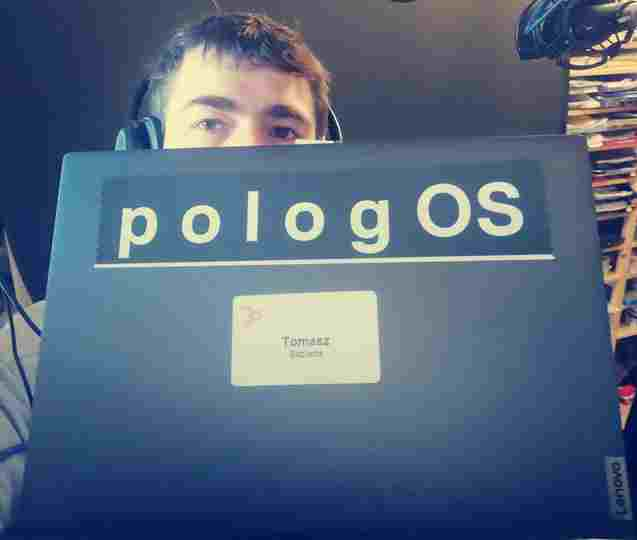

Aktualnie na rynku dostępne rozwiązania pozwalają na uzyskanie rozwiązań **text-to-image** czy **text-to-video**, jednak to dopiero początek.
Istotne z punktu widzenia kontroli jest oprogramowanie, które sztuczna inteligencja powinna najpierw napisać, uruchomić, przetestować i zintegrować z już istniejącym systemem wedle potrzeb człowieka.
Żadna firma na świecie nie oferuje takiego rozwiązania, tutaj prezentujemy wyjątek...

Jakie są korzyści z systemu operacyjnego, który generuje aplikacje na podstawie tekstowego opisu a nie kodu?

+ Szybszy czas tworzenia aplikacji, ponieważ tworzenie aplikacji z zaledwie kilku zdań jest znacznie szybsze niż tworzenie go z kodu. 
 
+ Zmniejszenie kosztów produkcji poprzez wyeliminowanie potrzeby tworzenia i utrzymywania dużych zespołów programistów. 

Sposoby tworzenia aplikacji z systemem **PoLoGoS**:

+ na podstawie tekstowego opisu daje większą swobodę tworzenia aplikacji. 
+ za pomocą interfejsu głosowego pozwala na tworzenie aplikacji w bardziej naturalny sposób. 
+ za pomocą języka naturalnego zwiększa dostępność aplikacji dla osób z różnych krajów.

## Korzyści

korzyści z używania platformy do generowania setek aplikacji dziennie w oparciu o sztuczną inteligencję:

1. Szybszy czas tworzenia aplikacji i wyższa wydajność. 

2. Wysoka jakość oprogramowania dzięki automatyzacji procesu tworzenia aplikacji za pomocą zaawansowanych technologii sztucznej inteligencji i uczenia maszynowego. 

3. Wyższy poziom bezpieczeństwa przez stosowanie zaawansowanych zabezpieczeń i kontroli dostępu. 

4. Zmniejszenie kosztów produkcji poprzez zautomatyzowany proces tworzenia aplikacji. 

5. Większa elastyczność i możliwość dostosowania do indywidualnych wymagań. 

6. Skalowalność, co pozwala na tworzenie setek aplikacji w krótkim czasie.

7. Poprawa jakości oprogramowania dzięki zaawansowanym technologiom sztucznej inteligencji i uczenia maszynowego. 

8. Zwiększona sprzedaż dzięki wyższej jakości produktów.

## Oszczędności 3 osobowego zespołu mogą sięgać kilkaset EUR dziennie

Przy zespole trzyosobowym oszczędności z używania takiego rozwiązania będą zależały od wielu czynników, takich jak ilość aplikacji tworzonych codziennie, doświadczenie programistów i ich stawki godzinowe. Niemniej jednak, przyjmując, że zespół tworzy **10 aplikacji** dziennie i ich stawki godzinowe wynoszą **25 EUR za godzinę**, oszczędność z używania takiego rozwiązania wynosić będzie około **750 EUR dziennie**.

["Dialogware Review Q4 2022"](https://www.youtube.com/watch?v=rthSm17nu8w)

# [Operacyjny System PoLoGoS - tworzący oprogramowanie w czasie rzeczywistym](http://www.pologos.com)

PoLoGoS jest rozwiązaniem dla firm które chcą szybko reagować na potrzeby swoich Klientów. 
System automatycznie **tworzy aplikacje w czasie rzeczywistym** za pomocą kilku zdań w języku naturalnym, bez potrzeby znajomości języków programowania.

Rozwiązanie **PoLoGoS** dedykujemy dla Software House-ów i developerów no-code:

+ to system operacyjny do tworzenia oprogramowania w czasie rzeczywistym **na podstawie opisu w języku naturalnym**

+ to rozwiązanie dla nie-programistów, którzy chcieliby tworzyć aplikacje **bez uczenia się języków programowania**

Sztuczna inteligencja zarządza procesem wytwarzania oprogramowania w czasie rzeczywistym, co umożliwia:

+ wytwarzanie oprogramowania **w ciągu minut** a nie dni czy miesięcy

+ **szybką reakcję** na dynamicznym rynku zaawansowanych technologii

Oferta jest tak innowacyjna, że obecnie **żadna firma na świecie** nie oferuje podobnego narzędzia, więc **tylko Ty i Twoja organizacja** będziecie mieli dostęp do unikalnych korzyści i unikalnej przewagi konkurencyjnej:

+ **Time to market** - Dostarczanie setek aplikacji dziennie w czasie rzeczywistym, 

+ **Time To Poc** - Tworzenie stron www, wizualnych interfejsów aplikacji, mikrousług **na podstawie krótkiego opisu**

Nasz interfejs tekstowym jest jeszcze w fazie rozwoju, ale już dziś możesz rezerwować dostęp, zyskując też bezpłatne **dożywotnie aktualizacje**.

+ Cena dostępu w modelu SaaS to *25EUR/msc przy płatności za rok z góry
+ Cena dostępu dożywotnio - lifetime to 900EUR jednorazowo.

*koszt dostępu będzie wzrastał po kolejnych aktualizacjach wnoszących poprawki i nowe funkcjonalności.

Ta oferta jest dostępna tylko **dla pierwszych 100 klientów**, którzy skorzystają z promocji **do końca marca 2023**. Po tym czasie **oferta lifetime** nie będzie już nigdy dostępna, pozostanie jedynie model SaaS z opłatą miesięczną w cenie 50EUR/msc, dlatego warto skorzystać z możliwości rezerwacji już dziś.

Zapraszam do kontaktu.

[Tomasz Sapletta](https://www.linkedin.com/in/tom-sapletta-com/)

Poszukuję entuzjastów zainteresowanych AUTOMATYZACJĄ od pojedynczych procesów po całą obsługę klienta. Oferuję platformę w przedsprzedaży, która tworzy aplikacje w czasie rzeczywistym za pomocą kilku zdań w języku naturalnym, bez potrzeby znajomości języków programowania.

# Przykłady użycia

Przykłady użycia rozwiązania text-to-software opartego o **PoLoGoS**.

## 1. Wdrożenie na produkcji

### 1.1 Potrzeba

Ograniczenie kosztów nocnej zmiany w fabryce.

### 1.2 Rozwiązanie

Aby zmniejszyć koszty konieczne jest zastąpienie personelu obsługującej dystrubujcę w fabryce na nocnej zmianie, umożliwiajac dostęp do fabryki z zewnątrz 24h dobę opprzez zautomatyzowane procesy na produkcji.
Elementy nowej infrastruktury to interfejs graficzny, tekstowy i głosowy z mikrofonem do wydawania komend, oraz głośnikiem do informowania kuriera przy odbieraniu zapakowanych produktów do klienta.

### 1.3 Korzyści

+ redukcja czasu pracy i kosztów z tym związanych
+ monitorowanie i integracja obsługi kurierów z zewnątrz
+ zwiększenie wydajności fabryki poprzez przeniesienie obsługi dotychczas ograniczonych przez obecność człowieka na tym etapie

### 1.4 Wdrożenie

System operacyjny instalujemy na urządzeniu IoT typu RPI z klawiaturą, monitorem, mikrofonem i głośnikiem.
+ Uruchamiamy z kartą SD z pobranym od nas systemem
+ Po kilku sekundach mamy dostęp do konsoli, logujemy się jako administrator
+ Wpisujemy w konsoli zadania jakie mają być realizowane
+ Należy napisać jakie dane mają być pobierane i skąd oraz w jaki sposób mają być przetwarzane.
+ Jaki interfejs chcemy używać do wybranych interakcji

Na każdym etapie poloSHELL umożliwia podsumowanie aktualnego etapu oraz proponuje kolejne kroki.

Do definiowania oprogramowania można wykorzystać tryb chat-u lub dokumentacji (SRS):

1. W trybie chatu AI odpytuje o istotne detale, przed uruchomieniem oprogramowania.

2. W trybie dokumentacji najpierw dostarczamy dokument, AI go przetwarza, uruchamia i pyta czy aplikacja spełnia oczekiwania.

W każdym trybie jest możliwa wielokrtona iteracja z testowaniem rezultatu w całości lub w części, np sam interfejs użytkownika.
Możliwe sa też tryby autodiagnostyki, gdzie wszystkie zewnętrzne API, urzadzenia są testowane.

#### 1.5 Monitorowanie

System operacyjny dostarcza informacje w postaci ustandaryzowane do różnych API zewnętrznych systemów

## 2. Wdrożenie w ecommerce

### 2.1 Potrzeba

Ogranicznie kosztów reklamacji

### 2.2 Rozwiązanie

Automatyzacja procesów kontaktu z klientem poprzez infolinię głosową, chat na stronie www
Przyjmowanie reklamacji po zwrotach od klientów dostarczonych przez kurierów.

### 2.3 Wdrożenie

System operacyjny instalujemy na urządzeniu IoT typu RPI z klawiaturą, monitorem, mikrofonem i głośnikiem.
+ Uruchamiamy z kartą SD z pobranym od nas systemem
+ Po kilku sekundach mamy dostęp do konsoli, logujemy się jako administrator
+ Wpisujemy w konsoli zadania jakie mają być realizowane

### 2.4 Monitorowanie

System operacyjny dostarcza informacje w postaci ustandaryzowane do różnych API zewnętrznych systemów

## 3. Wdrożenie w Software House

### 3.1 Potrzeba

Ogranicznie kosztów monitorowania aplikacji w sieci lokalnej 

### 3.2 Rozwiązanie

Automatyzacja procesów poprzez monitoring usług na wielu maszynach.
Interfejs graficzny dostepny poprzez lokalnego hosta http://localhost:8081
Wysyłanie powiadomienie SMS do administratora przy incydentach

### 3.3 Wdrożenie

System operacyjny instalujemy na lokalnym serwerze, wirtualizacji proxmox
+ Uruchamiamy installatora z pobranym od nas systemem w formacie ISO
+ Po kilku sekundach mamy dostęp do konsoli, logujemy się jako administrator
+ Wpisujemy w konsoli zadania jakie mają być realizowane

### 3.4 Monitorowanie

System operacyjny dostarcza informacje w postaci ustandaryzowane do różnych API zewnętrznych systemów

# EN Investors

What investors want to know

## Why are you competent for this project?
 
We have a big experience with many technical projects such as Currency online, BPM, Medical application, Recruitment application and more similar big bussiness projects. 
Most of them have many elements that require connection between different services and devices.
 

## Why this project is needed by the people?
 
Although the concepts of Industrial 4.0, 5G and smart solutions are ongoing trend, there are currently no tools that make it possible to develop these types of solutions quickly and efficiently. We have spoken with a wide range of experts and those who are seeking for automation solutions.

According to them, both sites have numerous issues: the client complains that the process is taking too long and is too expensive, while other specialist claims that the integration of various devices takes a very long time and is another factor in the high cost. 

Clients' inability to control automation is another issue (they need specialists to make changes).

## What is main different in this project?
 
Making complex robots was the inspiration behind this project. However, the state of technology today makes it impossible to produce complex robots in a reasonable time. Lack of tools is the cause of that condition. Therefore, we developed a tool that simplifies the connection and processing of many devices and services, which is at the basis of complicated smart systems and robotic solutions.
 

## What is the idea over (ro)bots or SaaS ?

We are not inspired by existing solutions; we just create what our consumers require the most. 
SaaS cannot connect to physical devices without a bridge,
Robots cannot do much on their own. 

We are also agitated by the installation of additional devices for IoT and Robots while lots of data in CCTV surveillance and alarm systems go unused for the majority of the day.

## What is necessary to make this project successful?  
 
Community is the key. 

This project provides a solution for many people, but it also offers an opportunity for many more. 

We offer complex logic for tons of sensors to provide most efficiency way to build smart city based on one operation system.

Each application, library, adapter, robot, and sensor created with compatibility for this system can be made by a third party, and we can help by selling them through marketplace.

This project has a great potential for growth if the community decides to use it or make money from it. Each hour spent working on the application for this project serves to automate the process for everyone who already owns this product.

## What are the chances that this project will succeed?  
 
People need a solution to manage all of this and make it simpler for them to adapt and expand their technological stack. The demand for new technology is high, as is the demand for robotics and smart solutions. 

We are aware of the logistical issues, the rising costs of many dependent elements, and the current global financial crisis. 
Moreover, just 50% of the world's population requires such a solution. 

Another risk is entering the market too soon and missing out on the potential 

### Documentation

+ [How I do my Computing](https://stallman.org/stallman-computing.html)

---

[edit](https://github.com/pologos/www/edit/main/README.md)

